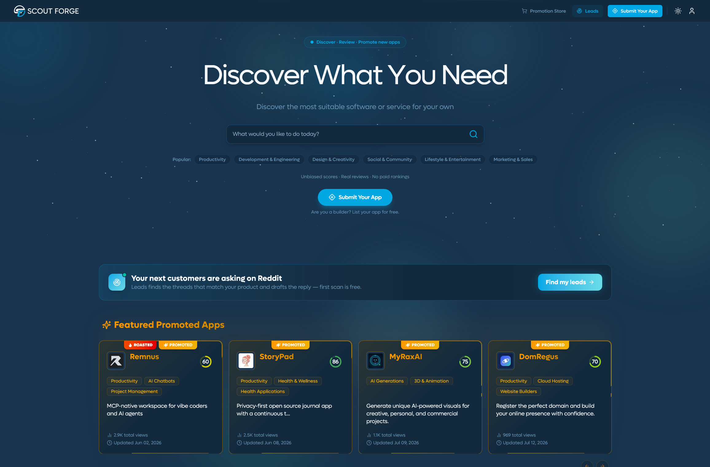
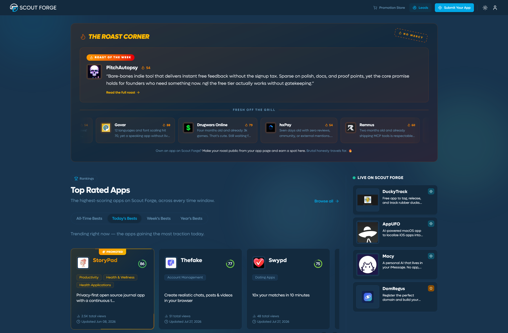
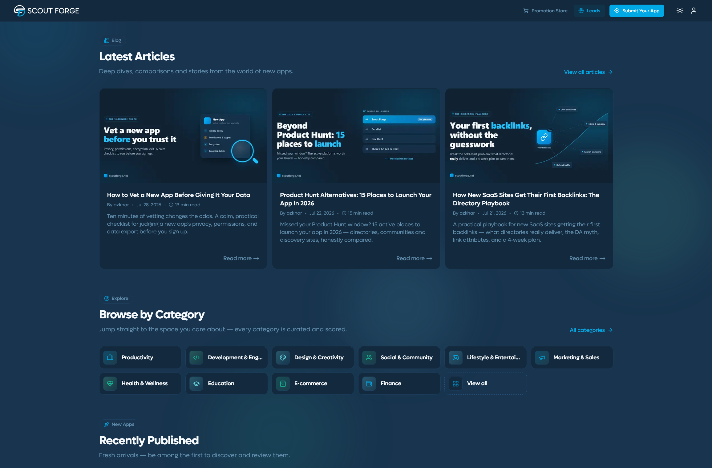
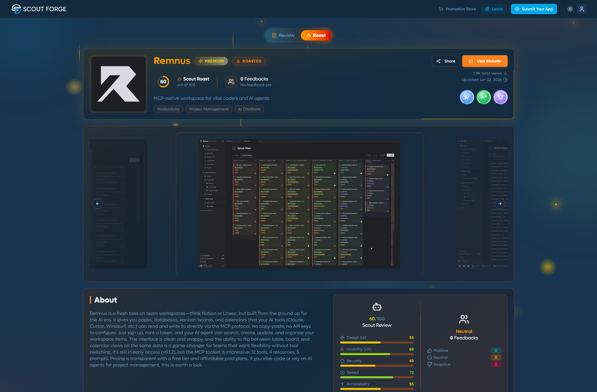
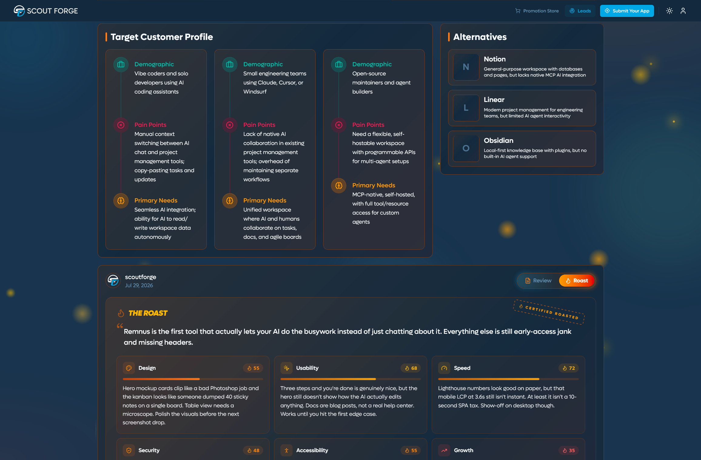
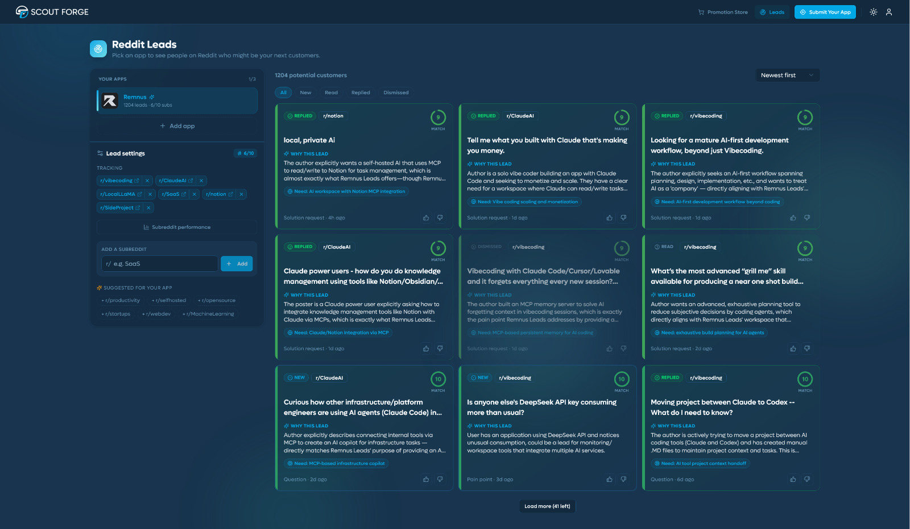
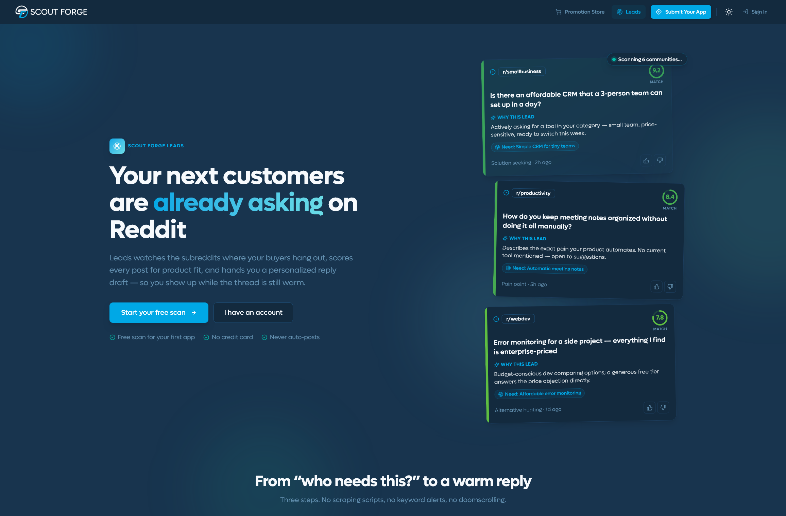
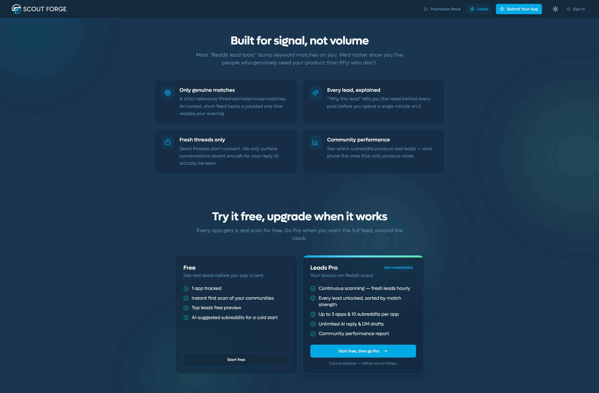
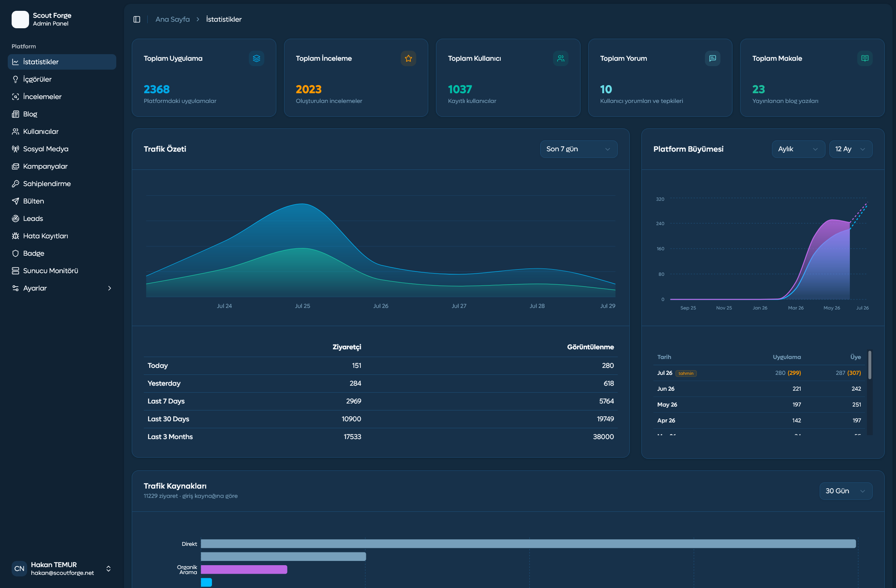

# ScoutForge — Frontend & Product Case Study

ScoutForge is a software discovery platform featuring more than 2,500 listed applications and over 1,000 registered users.

This repository presents a high-level case study of my work on the product. The production source code is private and is not included.

## Product Preview

### Software Discovery Experience
The public discovery experience helps users explore software products through searchable listings, categories, filters, and curated product information. I designed and developed the responsive frontend, reusable listing components, navigation structure, and product discovery flows.

---

### Application Detail Page
Application detail pages bring together product descriptions, ratings, categories, screenshots, ownership information, and related actions in a structured interface. I was responsible for the UI/UX design, responsive implementation, data presentation, and frontend integration of these pages.

---

### Reddit Leads
ScoutForge includes product-oriented workflows such as user onboarding, listing claims, promotions, and Reddit lead discovery. I designed and implemented the frontend flows, forms, validation states, feedback messages, and API integrations required to guide users through these multi-step processes.

---

### Multi-Module Admin Panel
The internal admin platform supports application management, user and claim operations, content review, promotions, moderation, and AI-assisted research workflows with human approval. I designed and developed the multi-module admin interface, including data tables, filters, forms, status controls, and operational dashboards.

---

## My Role

**Co-Founder | Frontend & Product Engineer**

I designed and developed both:

- The public-facing ScoutForge web application
- The multi-module internal admin panel

My responsibilities included:

- UI/UX design
- Responsive frontend development
- Product flow design
- API integration
- State and data management
- Performance improvements
- Production support
- Collaboration with the backend developer on API contracts

## Product Areas

### Public Application

The public product includes workflows such as:

- Software discovery and listing pages
- User onboarding
- Listing claim requests
- Promotions and featured placements
- Reddit lead discovery
- User account and product management
- Analytics-oriented product views

### Admin Platform

The internal admin platform supports operational workflows such as:

- Application and listing management
- User and claim management
- Content and promotion operations
- AI-assisted research workflows with human review
- Platform moderation and administrative processes

## Technical Stack

- Next.js
- React
- Redux Toolkit
- Tailwind CSS
- shadcn/ui
- React Hook Form
- Zod
- REST APIs

## Selected Engineering Responsibilities

- Built reusable and responsive interface structures for both public and administrative applications
- Implemented complex forms, data tables, filters, modals, and multi-step product flows
- Managed client-side state and server data integrations
- Worked with the backend developer to align API contracts with frontend requirements
- Investigated and resolved production issues affecting application stability and user experience
- Improved frontend performance and maintained the applications through continued product development

## Product Links

- [ScoutForge](https://scoutforge.net)
- [LinkedIn](https://www.linkedin.com/in/hakan-temur)

## Source Code

The production repositories are private because the platform is an actively developed commercial product.

This repository contains no production source code, credentials, internal API details, or user data.
